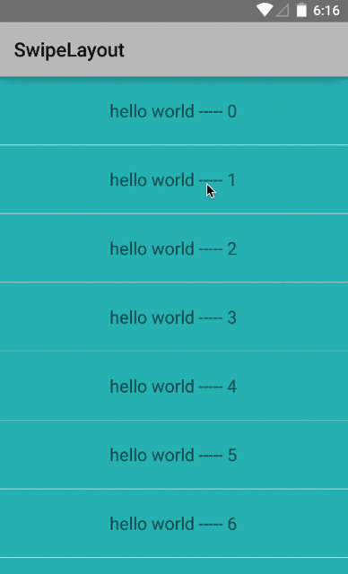
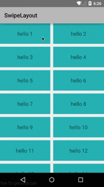

SwipeLayout
===========

Android 滑动显示菜单

##Demo

 --------  

##使用方法
```java
    //adapter
    class MyAdapater extends SwipeLayoutAdapter<String>
    {
        public MyAdapater(Activity context,int contentViewResourceId,int actionViewResourceId,List<String> objects)
        {
            super(context,contentViewResourceId,actionViewResourceId,objects);
        }

        @Override
        public void setContentView(View contentView, int position, HorizontalScrollView scrollParent) {
            //设置内容区
        }

        @Override
        public void setActionView(View actionView,final int position, final HorizontalScrollView scrollParent) {
 		//重写  设置滑动要显示的View

        }
    }
    //then set Adapter
    listView.setAdapter(new MyAdapter(......));
```